# Data Model and Mapping Diagrams

Pair-programmed by SE Community + Cortex Code

> Diagram companion to [the analytical contract](04-COWORK-CONTRACT.md). The contract
> is authoritative; where a diagram simplifies, the contract wins. Everything shown
> here describes the fictional fixture and the mapping gate — no customer schema,
> identifier or definition appears in this file.

Five views of the same system:

1. [Canonical tables and grains](#1-canonical-tables-and-grains) — what is stored, at what grain.
2. [Evidence lineage](#2-evidence-lineage) — how storage becomes something an agent may cite.
3. [Completeness and withholding](#3-completeness-and-withholding) — the three gates that decide whether a number is shown.
4. [Mapping boundary and status ladder](#4-mapping-boundary-and-status-ladder) — what a customer source must prove before it is trusted.
5. [Capability gating](#5-capability-gating) — which module is live, and which customer fact unblocks the rest.

---

## 1. Canonical tables and grains

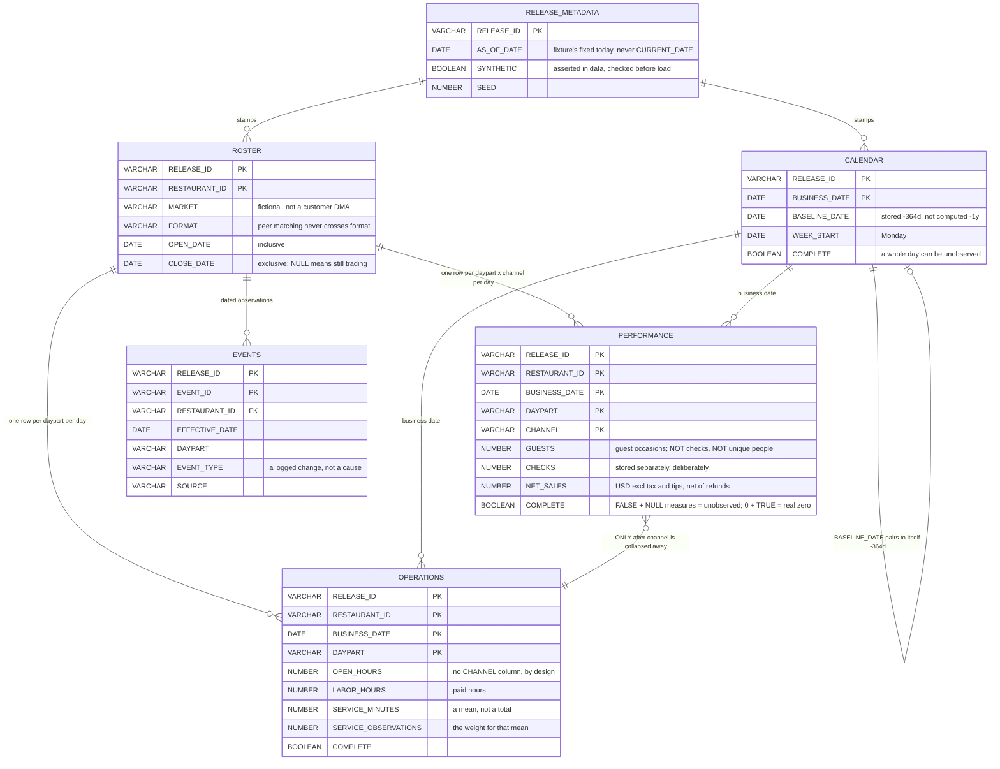

The single most consequential feature of this model is a column that does not exist.

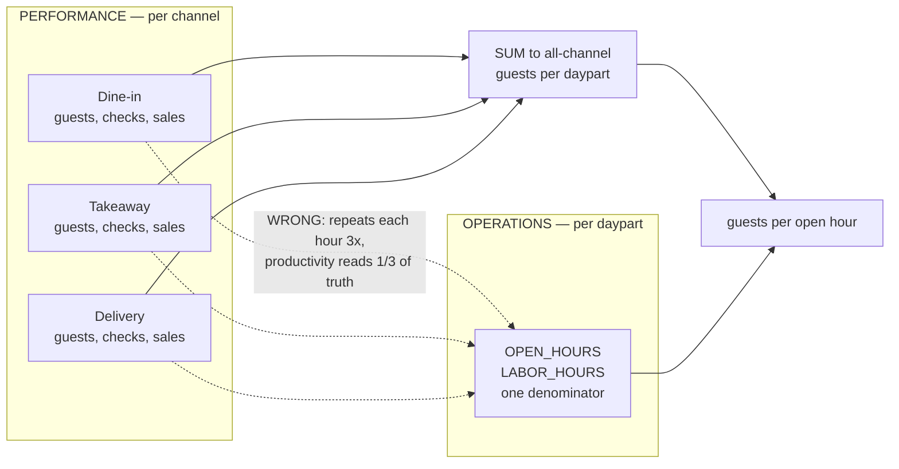

A restaurant opens its doors once per daypart and serves all three channels with those
same hours. There is no such thing as delivery open hours, so the column does not
exist to be misused, and a channel filter can never shrink the denominator.

Three ideas that get conflated constantly are kept apart:

| Idea | Where it lives | Note |
|---|---|---|
| Guest occasions | `PERFORMANCE.GUESTS` | People served on a visit |
| Checks | `PERFORMANCE.CHECKS` | Transactions, stored separately |
| Unique customers | **absent** | The data cannot answer retention and must not appear to |

---

## 2. Evidence lineage

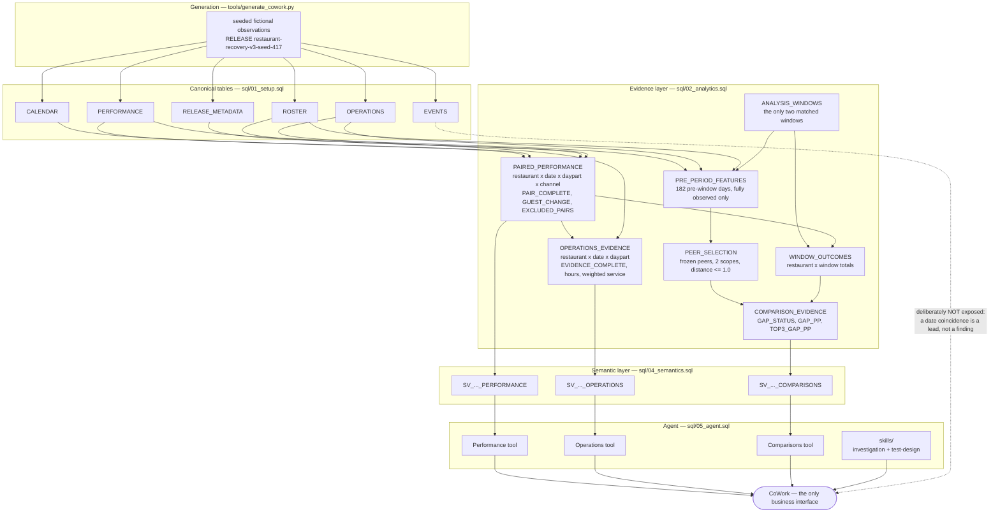

Two structural choices are visible here.

**The semantic layer reads the evidence views, never the raw tables.** The withholding
rules are compiled into SQL, so they cannot be bypassed from above — a model can be
argued out of a prompt guardrail, not out of a view definition.

**Three semantic views instead of one.** A single wide model would let the planner join
per-channel performance to all-channel hours. Splitting the model makes the most common
error in this domain unreachable rather than merely discouraged.

---

## 3. Completeness and withholding

Three independent gates. Each withholds; none imputes.

### 3a. Pair completeness — `PAIRED_PERFORMANCE`

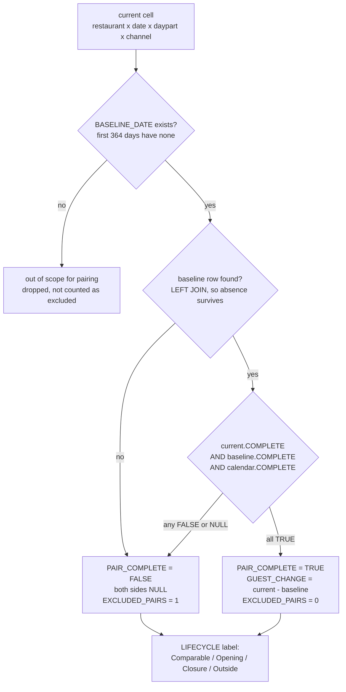

`COALESCE(..., FALSE)` is load-bearing: three-valued logic would otherwise leave
`PAIR_COMPLETE` unknown and let the downstream `IFF`s fall through. **Both** sides of a
broken pair are withheld — keeping the observed half would compare a full current period
against a partial baseline and invent a change.

Completeness and comparability are separate axes, and both are reported:

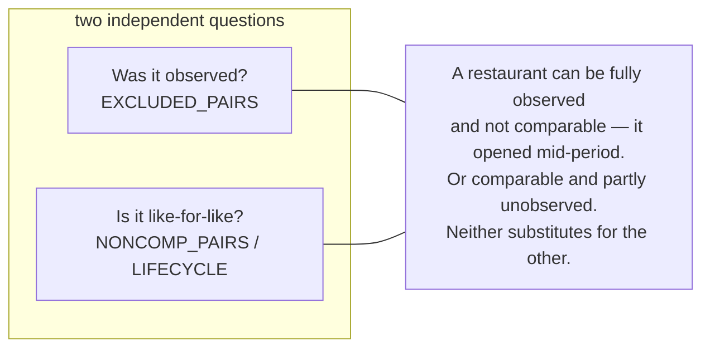

### 3b. Evidence completeness — `OPERATIONS_EVIDENCE`

Stricter than pair completeness, because a ratio is only honest when numerator and
denominator cover exactly the same trade.

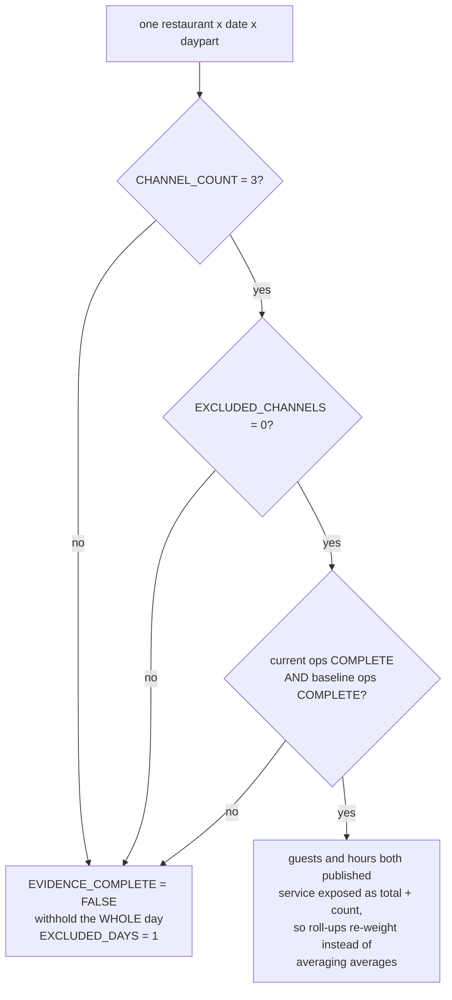

Withholding the whole day is the point: a shrunken numerator against an unchanged
denominator would look like a productivity collapse that never happened.

### 3c. Gap status — `COMPARISON_EVIDENCE`

Ordered most to least fundamental, so the reported reason is the root cause rather than
whichever check ran last.

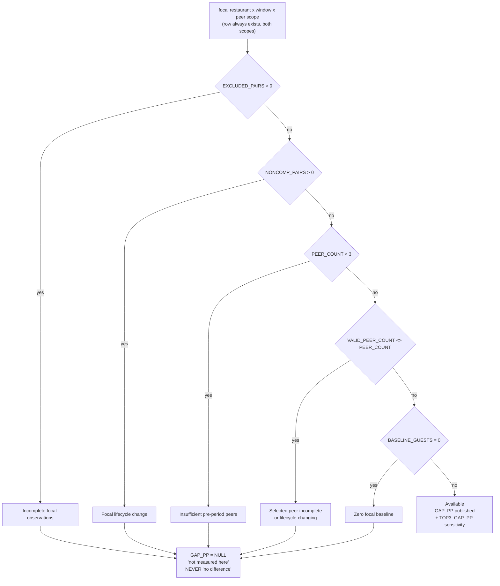

Peer selection runs on pre-period features only, and peers are frozen before outcomes
are seen:

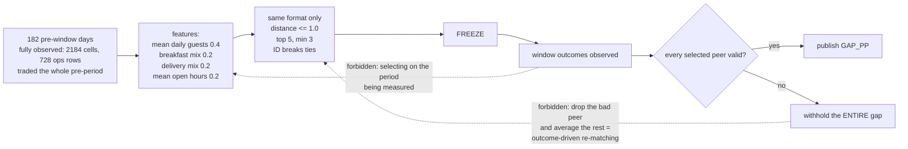

A matched gap is percentage points of difference versus similar restaurants over the
same dates. It is not an effect size, similarity peers are not automatically
experimental controls, and closing the gap is not a forecast of recoverable demand.

---

## 4. Mapping boundary and status ladder

Everything above runs on fictional observations. This section is what a real source has
to prove before any of it may be pointed at customer data.

### 4a. The gate

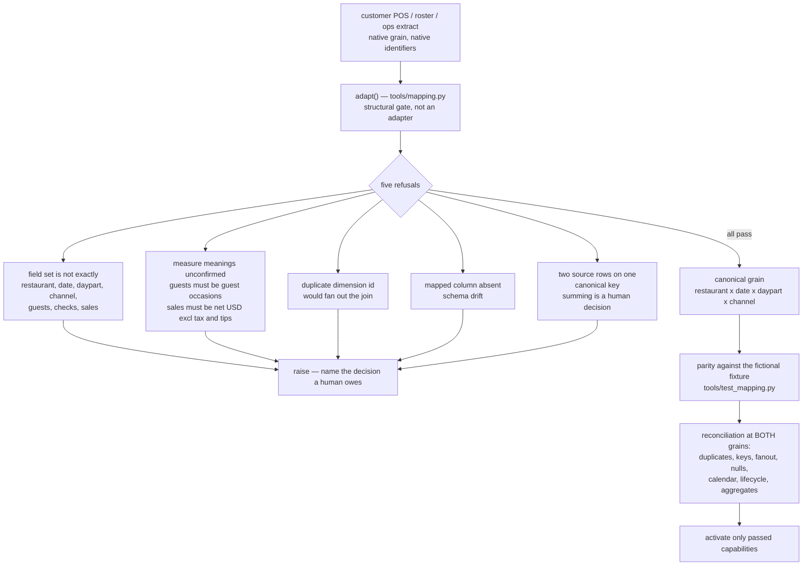

Each refusal exists because tolerating it produces silently wrong analytics. A missing
measure definition conflates guests with checks. A duplicate dimension row doubles
volumes. A duplicate canonical key sums two source rows by accident. None of these
announce themselves in a chart — the numbers simply come out wrong and look plausible.

`adapt()` is a gate, not a pipeline: it does not read from a customer system, does not
aggregate, and does not touch Snowflake.

### 4b. Status ladder

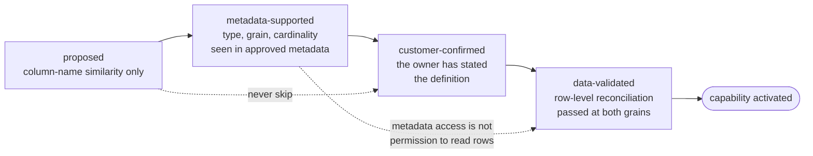

No numerical confidence scores. A name match supports a proposal and nothing more.

### 4c. The decisions a customer must actually make

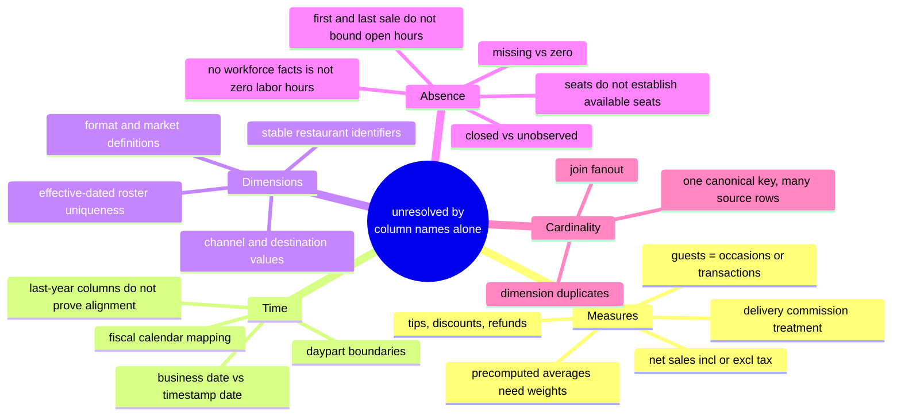

Anything unresolved on this map stops the affected capability. It is not repaired
automatically, and the stopping point is reported rather than worked around.

---

## 5. Capability gating

The eighteen modules, and the customer fact each one waits on. Core modules run on the
fictional fixture today; deferred modules are absent rather than approximated.

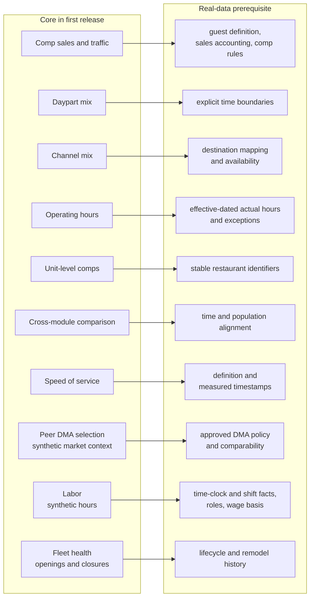

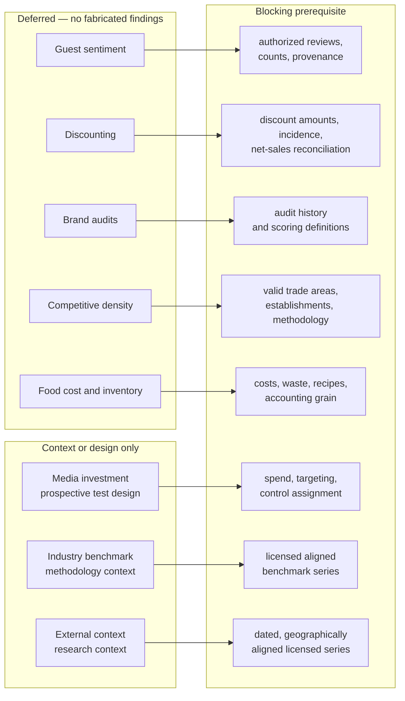

Loyalty and training are explicit extensions, not implied capabilities. No retention,
elasticity, ROI, recovered-guest promise or measured intervention effect exists without
the corresponding data **and** design.

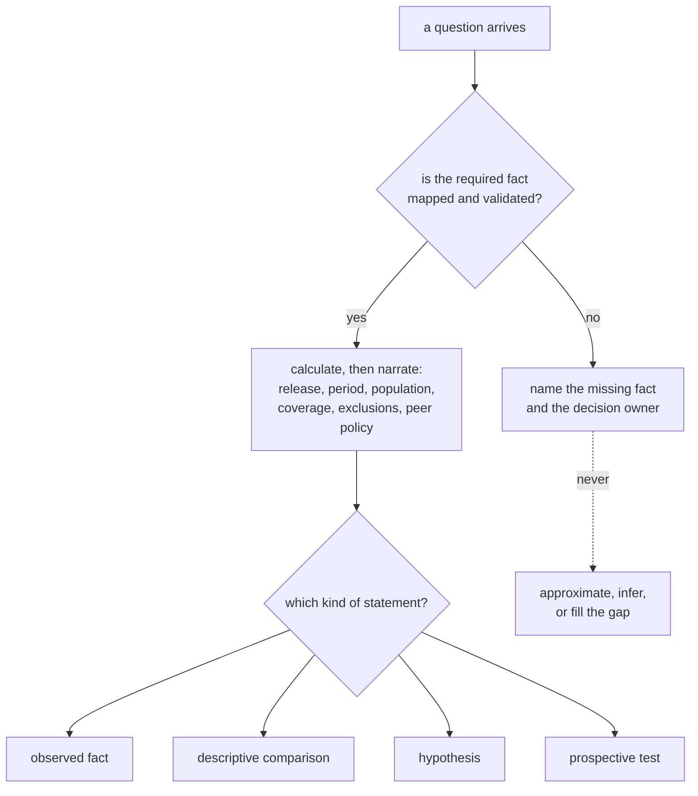

---

## Reading order for a newcomer

| To understand | Read |
|---|---|
| What is stored and why | §1, then `sql/01_setup.sql` |
| How a number earns the right to be shown | §3, then `sql/02_analytics.sql` |
| What the agent can see | §2, then `sql/04_semantics.sql` and `sql/05_agent.sql` |
| What adoption actually requires | §4 and §5, then `tools/mapping.py` and the source-mapping skill |
